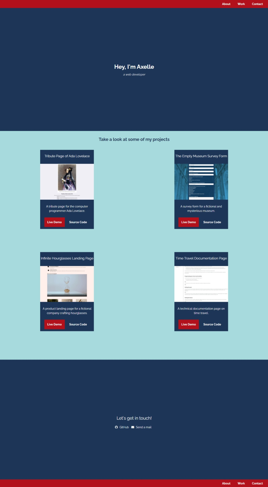

# Personal Portfolio

This portfolio is the final project for the Responsive Web Design Certification delivered by FreeCodeCamp.

## Description

This project was built with:
- Mobile-first workflow
- Semantic HTML5 markup
- CSS custom properties
- Flexbox
- CSS Grid
- Media queries

And tested with:
- The web accessibility evaluation tool (WAVE)
- The Markup Validation Service of W3C

## Live site

- Live Site URL: [GitHub Page](https://ax-cd.github.io/portfolio-fcc-project/)

## Screenshot

## Links

- Frontend Mentor - [@Ax-cd](https://www.frontendmentor.io/profile/Ax-cd)
- Instagram - [@ax.coding](https://www.instagram.com/ax.coding/)